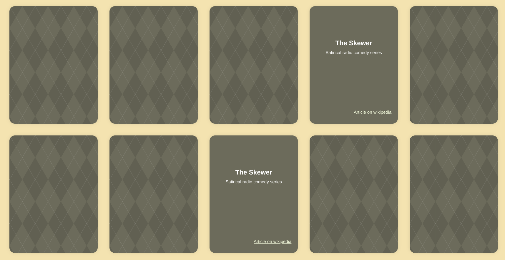

# Wiki-Memory
A memory card game using wiki articles as cards.

## Parameters
Currently, parameters can only be used by manually adding them to the url.

### Card count
A multiple of 2 (because there is a pair of each card) between 4 and 30.
Usage: `&cardCount=AMOUNT`

### Wiki
The site of the wiki that should be used for gathering articles for the cards.
The default is `wikipedia.org`, but it has also been used with other sites that run the WikiMedia software.
Usage: `&wikiUrl=SITE`
